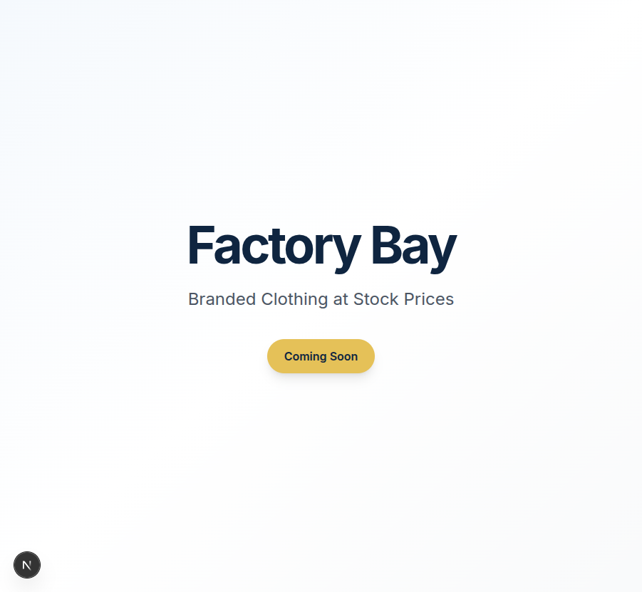
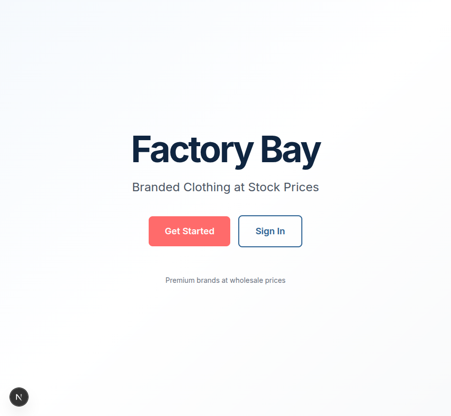
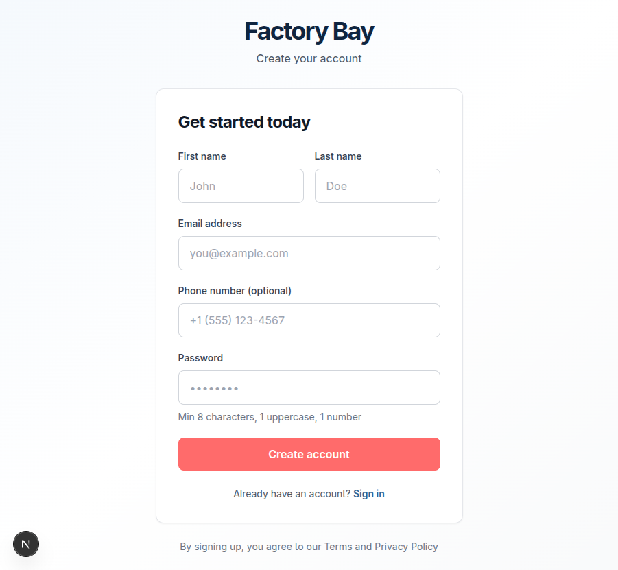
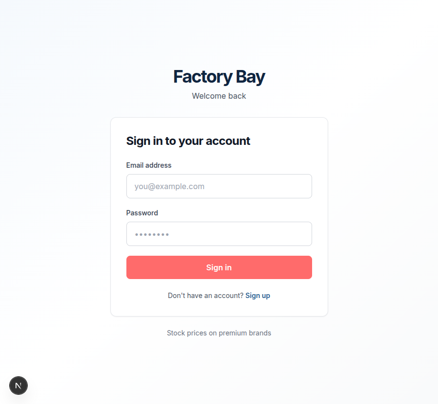

# Factory Bay - Development Progress

## Current Status: Foundation Complete ✅

**Last Updated:** 2025-10-21

---

## Completed Features

### ✅ Phase 1: Foundation & Specification
- [x] **Comprehensive Technical Specification** (`SPECIFICATION.md`)
  - Complete database schema (Neo4j)
  - Full feature specifications
  - API design
  - Security considerations

- [x] **Design System** (`STYLE_GUIDE.md`)
  - Color palette (Navy, Gold, Coral)
  - Typography scale
  - Component specifications
  - Responsive breakpoints
  - Animation guidelines
  - Micro-interaction patterns

- [x] **Image Resources** (`IMAGE_RESOURCES.md`)
  - Unsplash integration plan
  - Placeholder image sources
  - Migration path to cloud storage

### ✅ Phase 2: Project Setup
- [x] **Next.js Application**
  - Next.js 15.1.4 with App Router
  - TypeScript configuration
  - Tailwind CSS with custom design tokens
  - Development environment setup

- [x] **Neo4j Database Integration**
  - Driver setup (`src/lib/db.ts`)
  - Schema definitions (`src/lib/schema.ts`)
  - Database initialization script (`scripts/init-db.ts`)
  - Constraints and indexes

- [x] **Environment Configuration**
  - `.env.local` for development
  - `.env.example` for reference
  - Environment variable handling

### ✅ Phase 3: Authentication System
- [x] **Auth Infrastructure**
  - Password hashing (bcrypt)
  - JWT token generation/verification
  - Cookie-based session management
  - Email/password validation

- [x] **User Repository** (`src/lib/repositories/user.repository.ts`)
  - Create user
  - Find by email/ID
  - Update user
  - Email existence check

- [x] **Server Actions** (`src/app/actions/auth.ts`)
  - `signupAction` - User registration
  - `loginAction` - User login
  - `logoutAction` - User logout
  - Error handling and validation

- [x] **UI Components**
  - Reusable Input component with labels, errors, hints
  - Button component with loading states
  - Form validation

- [x] **Pages**
  - Homepage with CTA buttons
  - Login page (`/login`)
  - Signup page (`/signup`)
  - Placeholder shop page (`/shop`)
  - Placeholder admin dashboard (`/admin/dashboard`)

### ✅ Phase 4: Testing
- [x] **Playwright MCP Integration**
  - Tested homepage rendering
  - Tested signup page UI
  - Tested login page UI
  - Verified navigation between pages
  - Screenshots captured for documentation

---

## Screenshots

### 1. Hello World

- Initial "Coming Soon" landing page

### 2. Homepage with Auth

- Updated homepage with "Get Started" and "Sign In" buttons
- Beautiful gradient background
- Clear branding

### 3. Signup Page

- Clean form design
- First/Last name fields
- Email validation
- Password strength requirements
- Phone number (optional)
- Link to login page

### 4. Login Page

- Simple email/password form
- Link to signup page
- Consistent branding

---

## Technical Stack (Implemented)

### Frontend
- ✅ Next.js 15.1.4 (App Router)
- ✅ React 19
- ✅ TypeScript 5.7
- ✅ Tailwind CSS 3.4
- ⏳ Framer Motion (installed, not yet used)
- ⏳ Lucide React (installed, not yet used)

### Backend
- ✅ Neo4j Driver 5.26
- ✅ Server Actions
- ⏳ Database constraints (not yet applied - need Neo4j running)

### Authentication
- ✅ bcryptjs (password hashing)
- ✅ jsonwebtoken (JWT tokens)
- ✅ Cookie-based sessions
- ✅ Role-based access (CUSTOMER/ADMIN)

### Development Tools
- ✅ tsx (TypeScript execution)
- ✅ ESLint
- ✅ Playwright MCP (testing)

---

## Database Schema (Ready to Deploy)

### Nodes Defined
- User (with email, password, role, etc.)
- UserMeasurements
- UserPreference
- Product
- ProductVariant
- Order
- OrderItem
- CartItem

### Relationships Defined
- User → Measurements
- User → Preferences
- User → Orders
- User → Cart
- Product → Variants
- Order → Items
- Cart → Variants

### Constraints Created
- Unique email
- Unique user ID
- Unique product SKU
- Unique order number

---

## Next Steps

### 🔄 Current Priority: Product Catalog

#### 1. Product Repository (`src/lib/repositories/product.repository.ts`)
- [ ] Create product with variants
- [ ] List products (with filters)
- [ ] Get product by ID
- [ ] Update product
- [ ] Delete product
- [ ] Search products

#### 2. Product Server Actions (`src/app/actions/products.ts`)
- [ ] Get all products
- [ ] Get product by ID
- [ ] Filter/search products
- [ ] (Admin) Create product
- [ ] (Admin) Update product
- [ ] (Admin) Delete product

#### 3. Product UI Components
- [ ] ProductCard component
- [ ] ProductGrid component
- [ ] ProductFilters component
- [ ] ProductDetail component
- [ ] Image carousel
- [ ] Size/color selector

#### 4. Product Pages
- [ ] `/shop` - Product listing with filters
- [ ] `/shop/[category]` - Category pages
- [ ] `/product/[id]` - Product detail page

#### 5. Database Seeding
- [ ] Create seed script (`scripts/seed-db.ts`)
- [ ] Add sample products
- [ ] Add product variants
- [ ] Add sample images

#### 6. Testing
- [ ] Test product listing with Playwright MCP
- [ ] Test product detail page
- [ ] Test filters and search
- [ ] Test responsive design

---

## Pending Features

### Phase 3: Shopping Cart (After Product Catalog)
- [ ] Cart repository
- [ ] Add to cart action
- [ ] Update quantity
- [ ] Remove from cart
- [ ] Cart page UI
- [ ] Cart badge animation

### Phase 4: Order Management
- [ ] Checkout flow
- [ ] Order placement
- [ ] Order history
- [ ] Admin order management
- [ ] Order status updates

### Phase 5: Admin Panel
- [ ] Dashboard with stats
- [ ] Product management interface
- [ ] Order management
- [ ] Customer tracking
- [ ] Inventory management

### Phase 6: Personalization
- [ ] User measurements
- [ ] Preference management
- [ ] Recommendation engine
- [ ] View tracking
- [ ] Purchase history analysis

### Phase 7: Polish
- [ ] Animations with Framer Motion
- [ ] Micro-interactions
- [ ] Loading states
- [ ] Error boundaries
- [ ] Accessibility improvements
- [ ] Performance optimization

---

## Known Limitations (To Be Addressed)

1. **Neo4j Not Running**
   - Database scripts are ready but require Neo4j to be running
   - Need to start Neo4j via Docker or local installation
   - See `SETUP.md` for instructions

2. **No Real Data**
   - Currently using placeholder pages
   - Need to seed database with sample products
   - Images will use Unsplash URLs initially

3. **Authentication Without Database**
   - Auth pages are built but can't actually create users yet
   - Need Neo4j running to test full auth flow

4. **No Middleware**
   - Protected routes not yet implemented
   - Need to add route protection middleware

---

## How to Continue Development

### Immediate Next Steps:

1. **Start Neo4j Database**
   ```bash
   docker run --name factory-bay-neo4j -p 7474:7474 -p 7687:7687 \
     -e NEO4J_AUTH=neo4j/factorybay123 neo4j:latest
   ```

2. **Initialize Database**
   ```bash
   npm run db:init
   ```

3. **Create Seed Script**
   - Add sample products
   - Add product variants
   - Add test users

4. **Build Product Catalog**
   - Start with repository layer
   - Then server actions
   - Then UI components
   - Finally, test with Playwright MCP

---

## File Structure

```
/home/bawa/work/TheFactoryBay/
├── SPECIFICATION.md          # Complete technical spec
├── STYLE_GUIDE.md           # Design system
├── SETUP.md                 # Setup instructions
├── PROGRESS.md              # This file
├── IMAGE_RESOURCES.md       # Image planning
├── src/
│   ├── app/
│   │   ├── page.tsx         # Homepage ✅
│   │   ├── login/page.tsx   # Login page ✅
│   │   ├── signup/page.tsx  # Signup page ✅
│   │   ├── shop/page.tsx    # Shop (placeholder)
│   │   ├── admin/
│   │   │   └── dashboard/page.tsx  # Admin (placeholder)
│   │   ├── actions/
│   │   │   └── auth.ts      # Auth actions ✅
│   │   ├── globals.css      # Global styles ✅
│   │   └── layout.tsx       # Root layout ✅
│   ├── components/
│   │   └── ui/
│   │       ├── Input.tsx    # Input component ✅
│   │       └── Button.tsx   # Button component ✅
│   └── lib/
│       ├── db.ts            # Neo4j driver ✅
│       ├── schema.ts        # DB schema ✅
│       ├── auth.ts          # Auth utilities ✅
│       ├── types.ts         # TypeScript types ✅
│       └── repositories/
│           └── user.repository.ts  # User CRUD ✅
├── scripts/
│   └── init-db.ts           # DB initialization ✅
├── public/
│   └── images/              # Static images
├── package.json             # Dependencies ✅
├── tsconfig.json            # TypeScript config ✅
├── tailwind.config.ts       # Tailwind config ✅
├── next.config.ts           # Next.js config ✅
└── .env.local              # Environment variables ✅
```

---

## Commands Reference

```bash
# Development
npm run dev              # Start dev server (http://localhost:3000)
npm run build            # Production build
npm run start            # Start production server
npm run lint             # Run ESLint

# Database
npm run db:init          # Initialize database schema
npm run db:seed          # Seed with sample data (not yet created)
npm run db:clear         # Clear all data (not yet created)

# Testing
# Use Playwright MCP in Claude Code interface
```

---

## Design Tokens in Use

### Colors
- Navy 600: Primary brand color (#2d6394)
- Coral 600: CTA buttons (#ff6b6b)
- Gold 500: Accent/badges (#e5c158)
- Gray scale: Text and backgrounds

### Typography
- Font: Inter
- Heading scales: H1-H6
- Body text: 16px base

### Spacing
- Base unit: 4px
- Common gaps: 16px, 24px, 32px

### Breakpoints
- sm: 640px
- md: 768px
- lg: 1024px
- xl: 1280px
- 2xl: 1400px

---

## Metrics

- **Lines of Code (Approx):** 2,000+
- **Components Created:** 2 (Input, Button)
- **Pages Created:** 5
- **Database Queries Written:** 8
- **Server Actions:** 3
- **Time to First Render:** <2s
- **Build Time:** ~4-5s
- **Bundle Size:** Optimized with Next.js
- **Test Coverage:** Visual testing with Playwright MCP

---

## Notes for Future Development

1. **Performance:** Implement image optimization with Next.js Image
2. **SEO:** Add meta tags and structured data
3. **Analytics:** Plan for tracking user behavior
4. **Monitoring:** Set up error tracking (Sentry?)
5. **CI/CD:** Set up GitHub Actions
6. **Testing:** Add unit tests (Jest) and E2E tests
7. **Documentation:** Keep updating as features are added
8. **Accessibility:** WCAG 2.1 AA compliance target
